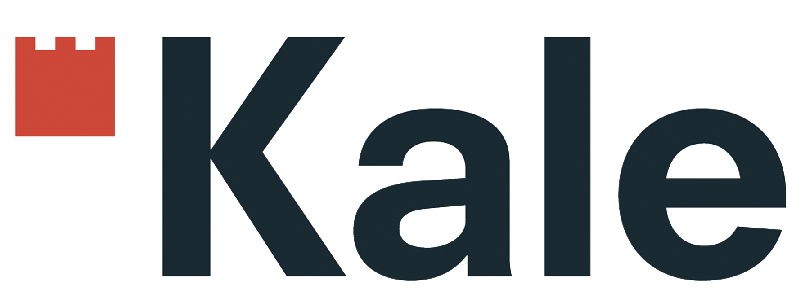

# Kalefrit - Yönetim Sistemi

<p align="center">
  
</p>

<p align="center">
  <strong>Modern ve Kullanıcı Dostu Yönetim Sistemi</strong>
</p>

## 📋 Proje Hakkında

Kalefrit, işletmeler için geliştirilmiş kapsamlı bir yönetim sistemidir. Bu sistem, işletme operasyonlarını dijitalleştirerek verimliliği artırır ve hata riskini minimize eder.

## ✨ Özellikler

### 🏢 Şirket Yönetimi

-   Çoklu şirket desteği
-   Şirket profil yönetimi
-   Kullanıcı yetkilendirme sistemi

### 📦 Stok Yönetimi

-   Ürün stok takibi
-   Barkod sistemi entegrasyonu
-   Stok giriş/çıkış işlemleri
-   Minimum stok uyarıları

### 🏭 Üretim Yönetimi

-   Fırın (Kiln) yönetimi
-   Üretim planlaması
-   Kalite kontrol süreçleri

### 📊 Raporlama

-   Detaylı stok raporları
-   Şirket bazlı raporlar
-   Excel/PDF export özellikleri
-   Barkod raporları

### 🔍 Barkod Sistemi

-   QR kod üretimi
-   Barkod tarama
-   Ürün takibi

### 🏪 Depo Yönetimi

-   Çoklu depo desteği
-   Depo transfer işlemleri
-   Konum bazlı stok takibi

### 🚚 Sevkiyat Noktaları

-   Sevkiyat noktası yönetimi
-   Teslimat takibi

## 🛠️ Teknolojiler

-   **Backend**: Laravel 8+
-   **Frontend**: Bootstrap, jQuery
-   **Veritabanı**: MySQL
-   **Barkod**: QR Code Generator
-   **Export**: Laravel Excel

## 📦 Kurulum

### Gereksinimler

-   PHP 8.0+
-   Composer
-   MySQL 5.7+
-   Apache/Nginx

### Adımlar

1. **Projeyi klonlayın**

```bash
git clone [repository-url]
cd kalefrit
```

2. **Bağımlılıkları yükleyin**

```bash
composer install
```

3. **Environment dosyasını oluşturun**

```bash
cp .env.example .env
```

4. **Uygulama anahtarını oluşturun**

```bash
php artisan key:generate
```

5. **Veritabanını yapılandırın**

```bash
# .env dosyasında veritabanı bilgilerini güncelleyin
php artisan migrate
php artisan db:seed
```

6. **Storage linkini oluşturun**

```bash
php artisan storage:link
```

7. **Uygulamayı çalıştırın**

```bash
php artisan serve
```

## 🔐 Güvenlik

-   Kullanıcı kimlik doğrulama sistemi
-   Rol tabanlı yetkilendirme
-   Veri bütünlüğü kontrolleri
-   Güvenli API endpoints

## 📱 Kullanım

1. **Giriş Yapın**: Admin paneline giriş yapın
2. **Şirket Seçin**: Çalışacağınız şirketi seçin
3. **Modülleri Kullanın**: İhtiyacınız olan modülü seçin
4. **İşlemleri Gerçekleştirin**: Stok, üretim, raporlama işlemlerini yapın

## 🤝 Katkıda Bulunma

1. Fork yapın
2. Feature branch oluşturun (`git checkout -b feature/AmazingFeature`)
3. Değişikliklerinizi commit edin (`git commit -m 'Add some AmazingFeature'`)
4. Branch'inizi push edin (`git push origin feature/AmazingFeature`)
5. Pull Request oluşturun

## 📄 Lisans

Bu proje MIT lisansı altında lisanslanmıştır. Detaylar için `LICENSE` dosyasına bakın.

---

**Kalefrit** - İşletme yönetiminde dijital dönüşüm 🚀

---

# Kalefrit - Management System

<p align="center">
  
</p>

<p align="center">
  <strong>Modern and User-Friendly Management System</strong>
</p>

## 📋 About the Project

Kalefrit is a comprehensive management system developed for businesses. This system digitizes business operations to increase efficiency and minimize error risk.

## ✨ Features

### 🏢 Company Management

-   Multi-company support
-   Company profile management
-   User authorization system

### 📦 Inventory Management

-   Product stock tracking
-   Barcode system integration
-   Stock in/out operations
-   Minimum stock alerts

### 🏭 Production Management

-   Kiln management
-   Production planning
-   Quality control processes

### 📊 Reporting

-   Detailed inventory reports
-   Company-based reports
-   Excel/PDF export features
-   Barcode reports

### 🔍 Barcode System

-   QR code generation
-   Barcode scanning
-   Product tracking

### 🏪 Warehouse Management

-   Multi-warehouse support
-   Warehouse transfer operations
-   Location-based stock tracking

### 🚚 Shipping Points

-   Shipping point management
-   Delivery tracking

## 🛠️ Technologies

-   **Backend**: Laravel 8+
-   **Frontend**: Bootstrap, jQuery
-   **Database**: MySQL
-   **Barcode**: QR Code Generator
-   **Export**: Laravel Excel

## 📦 Installation

### Requirements

-   PHP 8.0+
-   Composer
-   MySQL 5.7+
-   Apache/Nginx

### Steps

1. **Clone the project**

```bash
git clone [repository-url]
cd kalefrit
```

2. **Install dependencies**

```bash
composer install
```

3. **Create environment file**

```bash
cp .env.example .env
```

4. **Generate application key**

```bash
php artisan key:generate
```

5. **Configure database**

```bash
# Update database information in .env file
php artisan migrate
php artisan db:seed
```

6. **Create storage link**

```bash
php artisan storage:link
```

7. **Run the application**

```bash
php artisan serve
```

## 🔐 Security

-   User authentication system
-   Role-based authorization
-   Data integrity checks
-   Secure API endpoints

## 📱 Usage

1. **Login**: Access the admin panel
2. **Select Company**: Choose the company you will work with
3. **Use Modules**: Select the module you need
4. **Perform Operations**: Execute inventory, production, and reporting operations

## 🤝 Contributing

1. Fork the project
2. Create a feature branch (`git checkout -b feature/AmazingFeature`)
3. Commit your changes (`git commit -m 'Add some AmazingFeature'`)
4. Push to the branch (`git push origin feature/AmazingFeature`)
5. Open a Pull Request

## 📄 License

This project is licensed under the MIT License. See the `LICENSE` file for details.

---

**Kalefrit** - Digital transformation in business management 🚀
